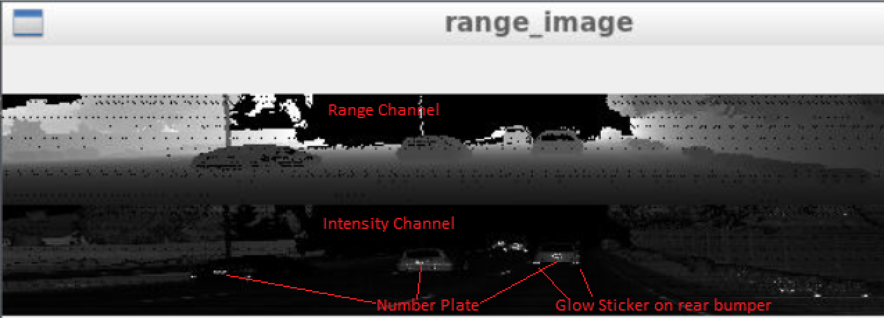
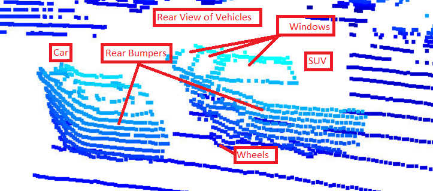
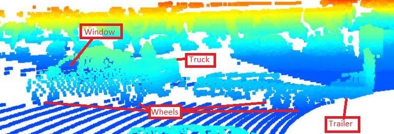
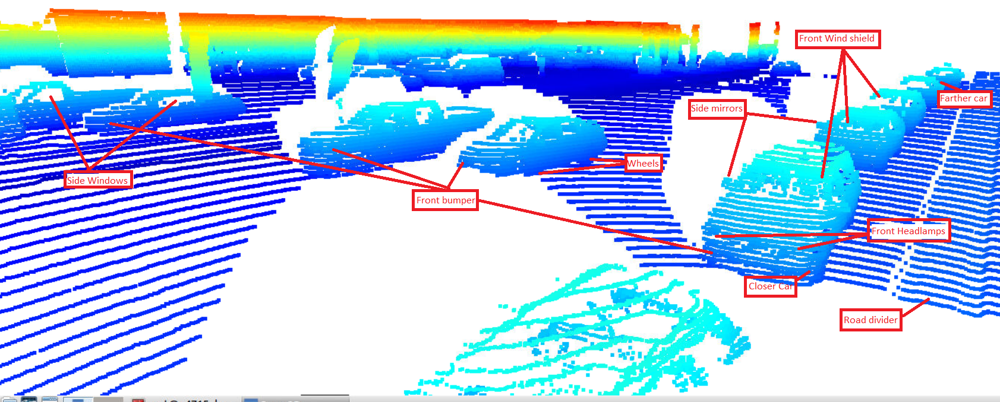
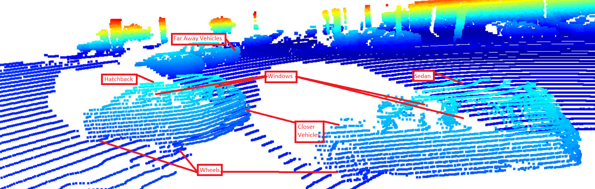
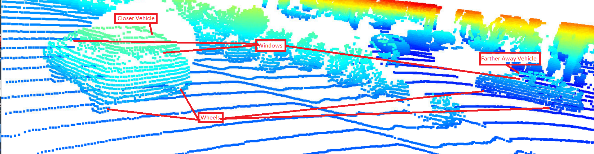

# 3D Object Detection write-up & output

Steps involved
 1. Extract Range Image & Intensity Channel 
 2. Convert Range Image to Point Cloud
 3. Visualize Point Cloud
 4. Convert Point Cloud to Bird Eye View(BEV)
 5. Instantiate 3d object detection model
 6. Compute IoU for detections
 7. Compute metrics for detection

PFB, the metric for 3d object detection on sequence 1 for frames 50 to 150. 

**Range Image & Intensity Channel Image**
The range images & the intensity channel images are shown below. We examine a few features of vehicles.
The objects that relect more appear brighter in the intensity channel.
PFB in range & intensity channel images, notable features that can be seen on multiple frames 

 - Tail Lamps
 - Number plates
 - Glow coates on pedestrians
 - Glow signboards
 - Head lamps

**Point Cloud Images**

PFB, a few features in the point cloud images. We have used view control and translate function of o3d visualization to visualize the vehicles at the varying degress of visibility.

 - Rear view
 - Rear bumper
 - Front View
 - Side View
 - Wheels
 - Multiple vehicles with varying degrees of visibility

